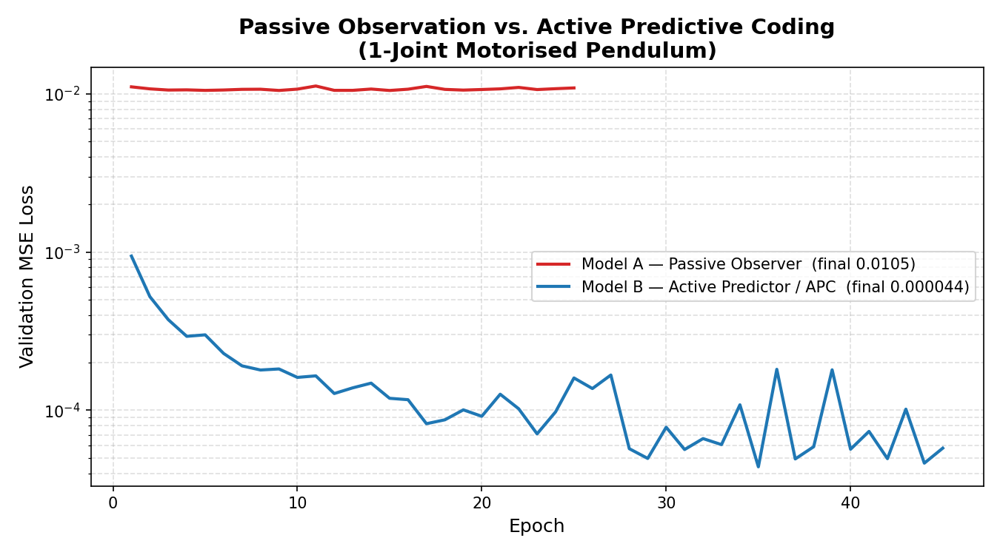

# Active Predictive Coding vs. Passive Observation
### Empirical Validation on a Continuous 1-Joint Motorised Pendulum

---

## Objective

This repository provides a minimal, reproducible proof-of-concept that
empirically tests **Pillar 1** of the framework proposed in:

> **Lessons from Neuroscience for AI**
> (*Zador, A. et al.*)
> — which argues that passive autoregressive models fail to learn true
> causal physics because they lack *efference copies*: internal signals
> that carry knowledge of the agent's own intended action.

Standard large-scale models observe sequences of states and learn to
predict the next token (or next state) from context alone.  When the
environment is driven by an external, unobserved control signal — such
as a motor torque — the mapping from state to next-state is
**one-to-many**: the same current state can lead to many different
successors depending on the hidden action.  A passive model is forced to
average over that latent variable, producing a "statistical blur" rather
than a sharp prediction.

Active Predictive Coding (APC) resolves this degeneracy by supplying
the model with the efference copy — the intended action — alongside the
sensory state.  Given `(state, action)`, the forward dynamics of a
deterministic physical system become a **one-to-one** mapping, and a
neural network of modest capacity can learn it to near-zero error.

This project demonstrates the effect cleanly by training two
architecturally identical networks on data from a simulated 1-degree-of-freedom
pendulum driven by random motor torques:

| Model | Input | Can it learn? |
|-------|-------|---------------|
| **A — Passive Observer** | `(θ, θ̇)` | ✗ — plateaus at high loss |
| **B — Active Predictor (APC)** | `(θ, θ̇, τ)` | ✓ — converges to ≈ 0 |

---

## The Physics

The environment is a **single rigid link** (pendulum) attached to a
motorised revolute joint, subject to gravity and viscous damping.

**State space**

| Symbol | Meaning | Unit |
|--------|---------|------|
| θ | Joint angle | rad |
| θ̇ | Angular velocity | rad/s |

**Action space**

| Symbol | Meaning | Unit |
|--------|---------|------|
| τ | Motor torque | N·m |

**Equation of motion**

$$\ddot{\theta} = \frac{\tau \;-\; m g L \sin(\theta) \;-\; b\,\dot{\theta}}{I}$$

| Parameter | Value | Description |
|-----------|-------|-------------|
| *m* | 1.0 kg | Link mass |
| *L* | 1.0 m | Pivot-to-CoM distance |
| *g* | 9.81 m/s² | Gravitational acceleration |
| *b* | 0.1 N·m·s/rad | Viscous damping |
| *I* | 1.0 kg·m² | Moment of inertia |
| *dt* | 0.05 s | Integration time-step |

Integration is performed with the **forward Euler** method.  At every
time-step the motor torque τ is sampled uniformly from `[−5, +5] N·m`,
producing chaotic, unpredictable swinging — the worst case for a passive
observer and the ideal test-bed for the efference-copy hypothesis.

---

## Results

The plot below (generated by `train.py`) shows the validation MSE on a
log scale for both models trained on 50,000 transitions with identical
architecture, optimiser, and early-stopping schedule.



**Model B (APC)** learns the deterministic forward dynamics to near-zero
error.  Supplying the efference copy collapses the one-to-many ambiguity
into a one-to-one function that a 3-layer MLP can approximate with high
fidelity.

**Model A (Passive Observer)** plateaus at a loss floor that reflects
the irreducible variance introduced by the hidden torque.  No amount of
additional training or capacity can overcome this — the model is missing
a causal variable.  Its best strategy is to predict the *expected*
next-state averaged over all possible torques, which is a poor
approximation of any *specific* outcome.

This result directly corroborates the neuroscience-inspired thesis: an
agent that models the consequences of its own actions (via efference
copies) achieves qualitatively superior world models compared to one
that passively observes state transitions.

---

## Repository Structure

```
├── simulator.py        # Physics engine & dataset generator
├── models.py           # Model A (passive) and Model B (APC) definitions
├── train.py            # Training loop, evaluation, and plotting
├── requirements.txt    # Python dependencies
└── README.md           # This file
```

---

## Quick Start

```bash
# 1. Create a virtual environment (recommended)
python -m venv .venv && source .venv/bin/activate

# 2. Install dependencies
pip install -r requirements.txt

# 3. Run the experiment
python train.py
```

On an Apple Silicon Mac with `tensorflow-macos` and `tensorflow-metal`,
training completes in under two minutes.  The script writes
`loss_comparison.png` to the working directory.

---

## Requirements

- Python ≥ 3.9
- TensorFlow 2.x  (for Apple Silicon: `tensorflow-macos` + `tensorflow-metal`)
- NumPy
- Matplotlib

---

## Citation

If you use this code in academic work, please cite the motivating paper:

```bibtex
@article{zador2023lessons,
  title   = {Catalyzing next-generation Artificial Intelligence
             through NeuroAI},
  author  = {Zador, Anthony and others},
  journal = {Nature Communications},
  year    = {2023}
}
```

---

## Licence

MIT# apc-robot-demo
